Bài 1

CRUD với Users

Login để lấy token
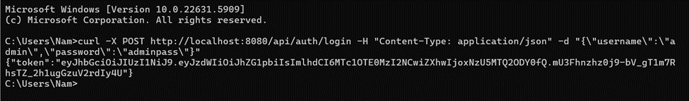

GET all users
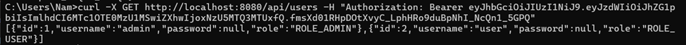

POST tạo user mới 
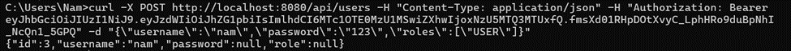
PUT cập nhật user 
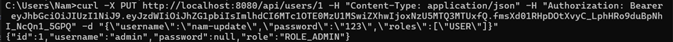
DELETE user 
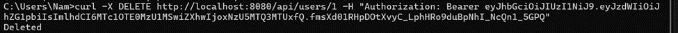
CRUD với Blogs

GET all blogs 
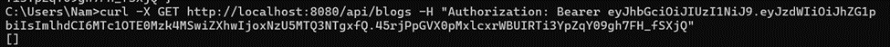
POST tạo blog mới
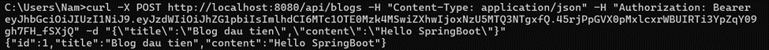

PUT cập nhật blog 
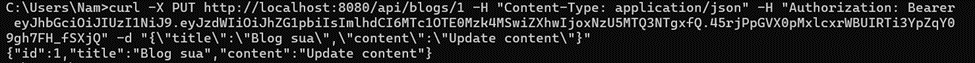
DELETE blog 
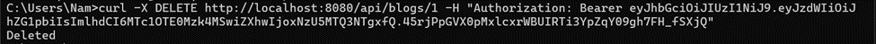
Bài 2

Sử dụng Spring Security + JWT để đăng nhập và sinh token.

Kiểm tra role trong DB(có trường role (admin/user)
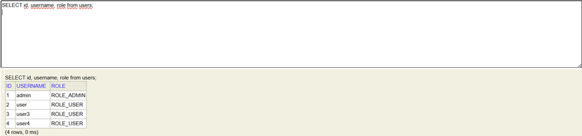

Chỉ ADMIN mới được xóa user(xóa user id 3)
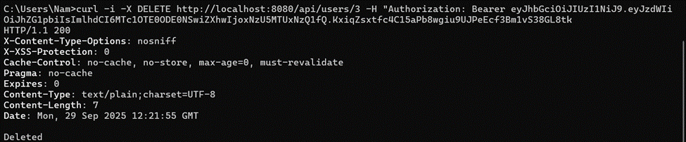

🡺thành công 200

Nếu user xóa user (xóa user id 4)
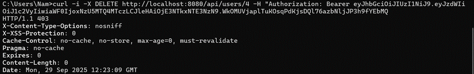

Thất bại 403
USER chỉ được xem / cập nhật blog của chính mình

Xem blog
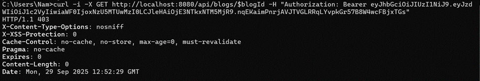

Tạo blog với user A
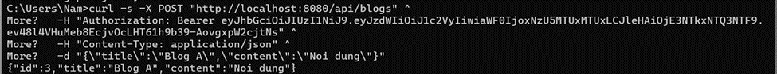

User xem và cập nhật blog của chính mình
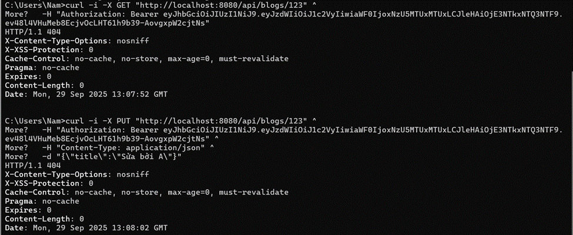